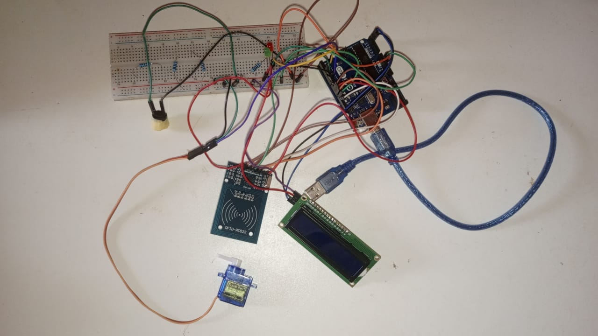

# Contrôle de Servo avec RFID et Arduino

Ce projet démontre comment lire des données à partir d'un PICC (Tag ou Carte RFID) en utilisant un lecteur RFID basé sur MFRC522 sur l'interface SPI d'Arduino, et contrôler un servomoteur en fonction de l'UID de la carte RFID.

## Composants Utilisés

- Arduino Uno (ou compatible)
- Lecteur RFID MFRC522
- Servomoteur
- Écran LCD I2C
- Buzzer
- LEDs (rouge et verte)
- Résistances (pour les LEDs)
- Fils de connexion
- Plaque de prototypage

## Schéma de Câblage

### Disposition des Broches Typiques
| Broche MFRC522 | Broche Arduino       |
| -------------- | -------------------- |
| RST            | 9                    |
| SDA(SS)        | 10                   |
| MOSI           | 11 / ICSP-4          |
| MISO           | 12 / ICSP-1          |
| SCK            | 13 / ICSP-3          |

### Composants Additionnels
| Composant  | Broche Arduino      |
| ---------- | ------------------- |
| Buzzer     | 8                   |
| LED Verte  | 4                   |
| LED Rouge  | 3                   |
| Servomoteur| 6                   |
| Écran LCD  | I2C (A4, A5)        |

## Bibliothèques Utilisées

- `SPI` : Pour la communication avec le lecteur RFID.
- `MFRC522` : Pour l'interface avec le module RFID.
- `LiquidCrystal_I2C` : Pour le contrôle de l'écran LCD.
- `Servo` : Pour le contrôle du servomoteur.

## Fonctionnalité

1. **Initialisation** : 
   - Initialise le lecteur RFID, l'écran LCD, le buzzer, les LEDs et le servomoteur.
   - Affiche un message de bienvenue sur l'écran LCD.

2. **Boucle Principale** :
   - Attend continuellement qu'une carte RFID soit présentée.
   - Si une nouvelle carte est détectée, lit son UID.
   - Vérifie l'UID par rapport à une valeur prédéfinie.
   - Si l'UID correspond, ouvre le servomoteur (par exemple, déverrouille une porte) et allume la LED verte.
   - Si l'UID ne correspond pas, active le buzzer et allume la LED rouge.

3. **Contrôle du Servomoteur** :
   - Le servomoteur est contrôlé pour se déplacer en douceur entre les positions à l'aide d'une fonction d'aide pour un mouvement progressif.

## Utilisation

1. **Connectez les Composants** : Suivez le schéma de câblage pour connecter le lecteur RFID, l'écran LCD, le servomoteur, le buzzer et les LEDs à l'Arduino.
2. **Téléchargez le Code** : Téléchargez le sketch Arduino fourni sur votre carte Arduino en utilisant l'IDE Arduino.
3. **Alimentez l'Arduino** : Alimentez votre Arduino via USB ou une alimentation externe.
4. **Présentez une Carte RFID** : Placez une carte RFID près du lecteur pour voir le système réagir en ouvrant le servomoteur ou en activant le buzzer en fonction de l'UID de la carte.

## Licence

Ce projet est publié dans le domaine public.

## Références

- [Répertoire GitHub de la bibliothèque MFRC522](https://github.com/miguelbalboa/rfid)
- Documentation et tutoriels Arduino
