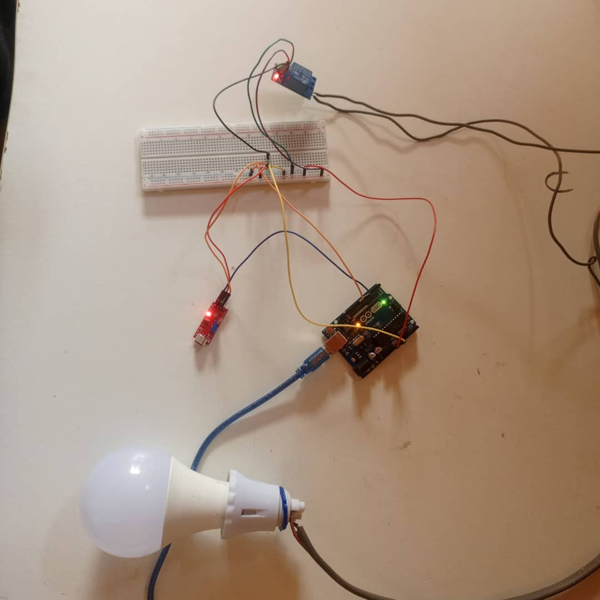

# Clap Controlled Lamp

Ce projet consiste à créer une lampe contrôlée par le son en utilisant un Arduino, un relais et un microphone. Ce projet m'a permis de mieux me familiariser avec les composants matériels et la programmation, renforçant ainsi ma passion pour l'Internet des objets (IoT).
## Montage 

## Matériels utilisés

- Arduino
- Relais
- Microphone
- Fils de connexion
- Lampe

## Description du projet

Ce projet utilise un microphone pour détecter le son d'un clap. Lorsque le microphone détecte deux claps successifs en moins de 3 secondes, il envoie un signal à l'Arduino. L'Arduino commande alors le relais pour allumer ou éteindre la lampe.

## Conclusion

Ce projet m'a permis de mieux comprendre le fonctionnement des microphones, des relais, et la programmation avec Arduino. J'ai également amélioré mes compétences en câblage et en détection de sons. Mon intérêt pour l'IoT a été renforcé grâce à cette expérience pratique.

## Auteur

Ce projet a été créé par [GUEDJE Godson](https://github.com/votre-nom-utilisateur).

## Licence

Ce projet est sous licence MIT. Voir le fichier [LICENSE](LICENSE) pour plus de détails.
